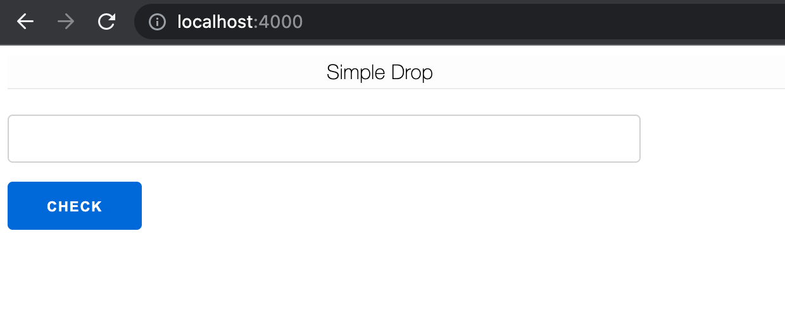

# SimpleDrop

A Simple Reward system for Cardano written in Phoenix Live View

https://simple-drop.fly.dev/



Steps needed for eligibility:

1. Create an address on Cardano's [Preview Testnet](https://book.world.dev.cardano.org/environments.html#preview-testnet)
2. Grab some tADA from the [faucet](https://faucet.preview.world.dev.cardano.org/basic-faucet)
2. Delegate to the JUNGLE Stake Pool on Preview testnet using the following pool id: `pool1j3x329u0uxh9s9vjvsad9kx37tzal8gndz6ttxumcz4nw947djw`
3. Wait a few seconds for the transaction to go through
4. Use your base address to check for eligibility. If your delegation went through, then you should be eligible! 

## Running in development

An existing [Blockfrost](https://blockfrost.io/) project_id is required to be set on following ENV:

```
BLOCKFROST_PROJECT_ID=""
```

To start your Phoenix server:

  * Install dependencies with `mix deps.get`
  * Create and migrate your database with `mix ecto.setup`
  * Start Phoenix endpoint with `mix phx.server` or inside IEx with `iex -S mix phx.server`

Now you can visit [`localhost:4000`](http://localhost:4000) from your browser.
